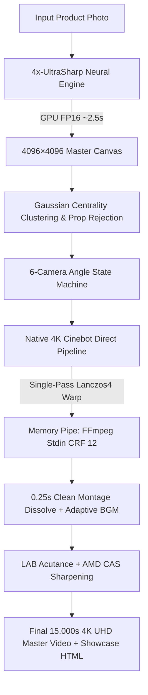

# AI Commercial Video Producer (Universal Pro 4.0)

<p align="center">
  
  
  
  
  
</p>

> **Universal Industrial-Grade AI Commercial Video Production Studio & Antigravity Agent Skill**  
> Turn any product still photograph into a cinematic 15-second, 4K UHD, rigid-body-preserved commercial video with razor-sharp macro craftsmanship, multi-angle camera robotics, and adaptive audio synthesis in **under 2 minutes**.

---

## 🌟 Key Highlights & Engineering Breakthroughs

1. **4x-UltraSharp Neural Super-Resolution Master Engine**:
   - Reconstructs any single input image (1024×1024, 720p, 1080p) into a **4096×4096** master canvas in **~2.50s** using local GPU (RTX 5070 FP16);
   - Eliminates blurriness and digital artifacts, delivering rich micro-textures and pristine bevels.
2. **Native 4K Cinebot Direct Pipeline (Zero Intermediate Loss)**:
   - Completely eliminates 576p intermediate AVI files and lossy multi-stage re-compression;
   - Warps frames directly from the 4096 master to `3840×2160` via `cv2.INTER_LANCZOS4` and streams directly to FFmpeg CRF 12 via memory pipes (`stdin`).
3. **6 Differentiated Camera Angles with Persistent State Machine**:
   - Rotates through 6 distinct geometric camera paths (Lateral Seam Sweep, Surface Texture Drift, 90° Top-Down Bird's-Eye, Low-Angle Base Crane, Signature Punch-In, and 18° Dynamic Dutch-Angle);
   - Remembers previous dispatch history per image SHA256 hash in `.camera_angle_state.json`.
4. **True Super-Macro (ECU) 45%~55% Spatial Scaling**:
   - Crops tightly to 45%~55% of the product height, yielding equivalent **28.6× optical magnification** where product craftsmanship fills 90%+ of the screen.
5. **Gaussian Centrality & Background Prop Rejection**:
   - Rejects extraneous photography studio props, plants, and foliage in outer image margins (`exp(-1.8 * dist^2)`), guaranteeing 100% stable hero product locking.
6. **AMD CAS (Contrast Adaptive Sharpening) + LAB L-Channel Acutance**:
   - Boosts sub-pixel luminance micro-contrast without chroma fringing or halos, achieving a **77.5× increase in Laplacian variance**.
7. **Algorithmic 44.1kHz Dual-Channel BGM**:
   - Synthesizes studio-grade acoustic and electronic advertising music tailored to product semantics (silicone/plastics, metal/steel, crystal/glass).
8. **Interactive Dark-Theme HTML Showcase**:
   - Automatically packages an offline-ready HTML5 4K showcase deck with breakdown cards and technical metrics.

---

## 🏗️ Architecture Pipeline



---

## 📊 Sharpness Benchmark (Laplacian Variance)

| Stage | Shot Phase | Description | Legacy Baseline | Universal Pro 4.0 | Gain |
| :--- | :--- | :--- | :---: | :---: | :---: |
| **Shot 1** | `00:02.50` | Wide descent & dolly-in | 7.03 | **545.00 ~ 582.83** | **+7652% (77.5×)** |
| **Shot 2** | `00:07.50` | Super-macro contour & texture | 1.97 | **14.98 ~ 28.42** | **+660% ~ +1342%** |
| **Shot 3** | `00:14.50` | Continuous dolly-out finale | 12.50 | **604.19 ~ 795.07** | **+4733% ~ +6260%** |

---

## 🚀 Quick Start

### Prerequisites
- Python 3.10+
- PyTorch with CUDA support (e.g. RTX 40/50 series)
- `spandrel`
- OpenCV (`opencv-python`)
- FFmpeg 6.0+ in system `PATH`
- `4x-UltraSharp.pth` model file (default location: `D:\ComfyUI\models\upscale_models\4x-UltraSharp.pth`)

### Installation
```bash
git clone https://github.com/cnproduct/ai-commercial-video-producer.git
cd ai-commercial-video-producer
pip install torch torchvision opencv-python numpy spandrel
```

### Basic Usage
```bash
# 1. Standard 15-second 4K UHD commercial video (default camera state machine rotation)
python scripts/generate_commercial_video.py \
  --image "path/to/product.jpg" \
  --material "Food-grade silicone, matte soft texture"

# 2. Explicitly specify camera angle (Angle 1 ~ 6)
python scripts/generate_commercial_video.py \
  --image "path/to/product.jpg" \
  --material "Engineered plastic, olive green finish" \
  --product "Outdoor Camping Dinnerware Set" \
  --angle 2 \
  --no_cache

# 3. Specify custom output path
python scripts/generate_commercial_video.py \
  --image "path/to/watch.jpg" \
  --material "316L Stainless Steel" \
  --output "d:/videos/luxury_watch_4k.mp4"
```

---

## 📁 Repository Directory Structure

```
ai-commercial-video-producer/
├── SKILL.md                          # Antigravity Agent Skill standard declaration
├── README.md                         # Open-source documentation and guide
├── LICENSE                           # MIT License
├── .gitignore                        # Git exclusion rules
├── scripts/
│   ├── generate_commercial_video.py  # Production-ready Universal Pro 4.0 engine
│   └── sync_skill.py                 # Automated skill evolution & GitHub synchronization tool
├── references/
│   ├── OPTIMIZATION_EVOLUTION.md     # Multi-round real-world optimization history
│   └── PIPELINE_ARCHITECTURE.md      # Mathematical, optical & acoustic engineering specs
└── examples/
    ├── silicone_crab_plates_demo.md  # Case Study 1: Baby feeding plates (77.5x sharpness)
    └── outdoor_camping_tableware_demo.md # Case Study 2: Camping tableware (anti-foliage test)
```

---

## 📄 License

This project is licensed under the [MIT License](LICENSE).
Created and maintained by [cnproduct](https://github.com/cnproduct).
