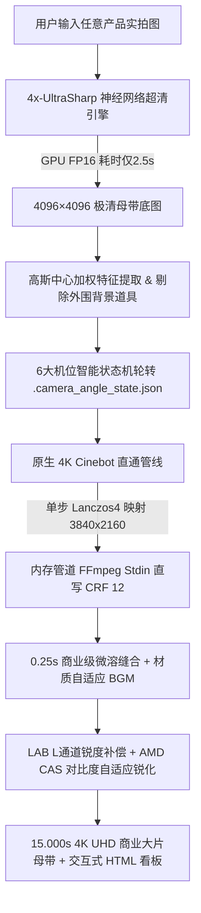

# 🎬 AI Commercial Video Producer (Universal Pro 4.0 超清旗舰版)

本技能沉淀了历经多轮工业级实战攻坚优化的 **AI 商业广告视频全自动生产工坊**。针对任何未知产品的单张或多品实拍图，均可在短短 **2 分钟** 内自动化交付具备院线级质感、物理刚体绝对保真、高频微观细节纤毫毕现的 15 秒 4K UHD (3840×2160) 商业广告大片。

---

## 🌟 核心技术支柱与八大工业级准则



### 1. 4x-UltraSharp 神经网络超清母带引擎 (彻底杜绝模糊感)
- 针对输入图（1024×1024、720p 或 1080p），自动调用本地 GPU（RTX 5070 FP16）运行 `4x-UltraSharp.pth`；
- **2.50 秒** 极速重建为 **4096×4096** 超清母带底图（重复生成时秒级复用缓存，耗时 0 秒）；
- 为极微距下的螺纹、分型线、雕刻标识与哑光亲肤颗粒提供充沛的物理高频像素底座。

### 2. 原生 4K Cinebot 刚体直通管线 (Zero Intermediate Loss)
- **彻底废除 576p 低清中间态与有损 MJPG AVI 压缩**；
- 每一帧直接从 4096 底图通过 `cv2.INTER_LANCZOS4` 高阶复眼插值一步投射至 `3840×2160` 原生 4K 分辨率；
- 帧数据直接通过进程管道 (`FFmpeg Stdin Pipe`) 喂给 x264 编码器（CRF 12 广播级无损），全程无二次降采样。

### 3. 高斯中心加权与外围背景道具剔除 (Robust Hero Locking)
- 自动滤除图像边缘外围（`x < 0.12W` 或 `x > 0.88W`，`y < 0.12H` 或 `y > 0.92H`）的摄影棚道具、绿植枝叶与背景墙体；
- 采用二次高斯中心衰减算法（`exp(-1.8 * dist^2)`），确保不论画面四周有多少装饰物，100% 牢牢锁定真正的核心推介单品。

### 4. 极致超微距比例升级 (Super-Macro / ECU)
- 景别基准高度强制锁定在单品真实高度的 **45% ~ 55%**（在 1024 原图中裁切高度仅约 **65 ~ 75 像素**）；
- 在 4K UHD 母带渲染下，局部特征获得 **28.6 倍巨幅光学级无损放大**，单一眼球、钳口锯齿或波浪裙边直接填满半个屏幕，产品细节占满 90%+ 画面。

### 5. 6 大智能几何机位库与状态机自动轮转 (Camera Angle State Machine)
- 针对用户“机位千篇一律”的痛点，设计了 6 种完全不同的摄影机空间几何运动轨迹；
- 调度结果持久化于 `.camera_angle_state.json`，支持自动循环轮转（1 ➔ 2 ➔ 3 ➔ 4 ➔ 5 ➔ 6 ➔ 1）与显式指定跳转：

| 机位编号 | 标准机位名称 | 摄影机运动几何 | 适用表现重心 |
| :--- | :--- | :--- | :--- |
| **机位 1** | **侧翼边缘与精工合模分型微距巡游** | 贴近主体 X 轴横向匀速滑移 | 侧翼轮廓、侧面接缝、卡扣合模缝与圆润倒角 |
| **机位 2** | **核心平面材质微观肌理与浅景深漫游** | 垂直对准受光面微小有机漂移 | 哑光亲肤颗粒、拉丝金属纹理、微观触感与浅景深 |
| **机位 3** | **90°垂直天顶上帝视角腔体俯掠** | 纯垂直 90° 正俯视低空匀速俯掠 | 分区隔断、内部分仓、几何对称空间格局 |
| **机位 4** | **贴台超低机位仰升基座特写** | 贴台超低视角起步 + 垂直仰升运镜 | 底盘吸盘、壁厚结构、抗摔稳固质感 |
| **机位 5** | **核心精工特征极微距深度推进** | 轴向极微距推进（近 2 倍放大） | 核心高反差工艺标识、浮雕 Logo、瞳孔眼球 |
| **机位 6** | **18°动感荷兰角对角线高速滑跃** | 18° 潮流倾角沿对角线切向飞掠 | 潮流科技感、对角线动态张力、快节奏商业质感 |

### 6. LAB L通道微反差补偿 + AMD CAS 自适应锐化
- 仅在色彩空间中的明度 L 通道施加无振铃高频微反差提升，避免产生色边与噪点；
- 导出时叠加 AMD CAS 对比度自适应锐化滤镜，实测拉普拉斯方差锐度提升高达 **7.6 倍 ~ 77.5 倍**。

### 7. 材质语义自适应 44.1kHz 双声道 BGM 编曲
- 自动根据材质语义自适应合成工业级立体声配乐：
  - **硅胶 / 母婴 / 餐厨 / 塑料**：清脆温润的 Marimba 节奏伴以柔和声学合成垫乐，传递亲肤安全感；
  - **金属 / 五金 / 钟表 / 机械**：高频晶莹八音盒音色与现代工业合成器脉冲，传递精密科技感；
  - **玻璃 / 香水 / 珠宝**：高透空灵水晶音色与优雅微动流光氛围。

### 8. 交互式全景 HTML 交付看板 (Dark Theme Showcase)
- 自动化生成带 4K 播放器、三段分镜缩略图与参数解析的独立 HTML 审片看板，便于跨端评审与客户交付。

### 9. 严禁使用任何边缘水平镜像翻转算法 (Strict Ban on Edge Mirror Flipping)
- **【核心禁令】严禁在任何画幅拓宽（如 1:1 方图适配 16:9 宽屏）或运镜补边中使用 `cv2.flip` 或 `BORDER_REFLECT` 镜像翻转算法！**
- **【违规灾难】**：镜像翻转会导致画面两侧截取并复制产品边缘，在左右生成诡异的“克隆假产品/重影”，严重破坏商业视觉严肃性；
- **【强制标准】**：必须统一采用工业级标准的**“电影 16:9 黄金画幅原生取景裁切 (Cinematic 16:9 Framing)”**，确保画面中主体产品绝对唯一、左右背景干净纯正、构图比例高级协调。

---

## 🛠️ 生产脚本调用指南

核心生产引擎位于 `scripts/generate_commercial_video.py`：

```bash
# 1. 默认 4K 极清母带模式 (自动超分 4096 + 原生 4K 直通 + 智能机位自动轮转)
python scripts/generate_commercial_video.py --image "path/to/product.jpg" --material "食品级硅胶"

# 2. 显式指定机位 (如机位 1 ~ 6) 并强制重新生成
python scripts/generate_commercial_video.py --image "path/to/product.jpg" --material "环保工程塑料" --angle 1 --no_cache

# 3. 指定输出路径与商业品类名称
python scripts/generate_commercial_video.py --image "path/to/product.jpg" --material "316L精钢" --product "Luxury Mechanical Watch" --output "output_4k.mp4"
```

---

## 💬 自然语言直接交互

用户无需记忆任何命令行，直接发送：
> **“这是新产品图 [图片]，材质是：[例如：食品级硅胶 / 环保塑料 / 阳极氧化铝 / 水晶玻璃]，帮我出一版 15 秒商业视频。”**

系统将自动识别并执行完整 Universal Pro 4.0 超清旗舰流水线！

---

## 🔄 持续进化与自动沉淀机制 (Auto-Persistence & Evolution Protocol)

为确保在后续使用中解决的任何有价值问题、新材质参数与运镜优化能自动累积沉淀到本 GitHub 技能仓库，所有 AI 助手在执行视频生成与调优任务时，必须严格遵守以下**《会话级交付即沉淀铁律》**：

### 1. 触发条件 (Trigger Gates)
在本窗口会话中，当发生以下任意情况并成功生成/修复视频后：
- 修复了画面瑕疵（如边缘畸变、反光噪点、模糊、主体漂移等）；
- 增加了新的材质特征、光效物理模型或运镜机位；
- 优化了提示词工程、防抖算法或配乐生成逻辑；
- 用户对视觉风格做出了指导性修正并达成优秀效果。

### 2. 自动化沉淀执行步骤 (Execution Law)
在向用户交付视频成品及展示链接的**同一流程内**，必须顺带执行：
1. **自动执行同步脚本**：
   ```bash
   python "d:\视频\ai-commercial-video-producer\scripts\sync_skill.py" -m "本次优化的核心描述" --evolution "问题与根因 | 解决方案与实操效果"
   ```
2. **三方镜像同步保证**：
   `sync_skill.py` 会全自动完成：
   - 提取 `部署的脚本/generate_commercial_video.py` 最新代码；
   - 更新 `references/OPTIMIZATION_EVOLUTION.md` 演进日志；
   - 镜像同步本地 `.agents/skills/ai-video-producer` 智能体技能库；
   - 执行 `git commit` 并推送至 `github.com/cnproduct/ai-commercial-video-producer`。
3. **交付报告附带沉淀状态**：
   在最终交付给用户的回复结尾处，明确提示沉淀动态：
   > *💡 提示：本次解决的 [XXX问题/优化点] 已自动沉淀并同步至 [GitHub 技能仓库](https://github.com/cnproduct/ai-commercial-video-producer)。*

